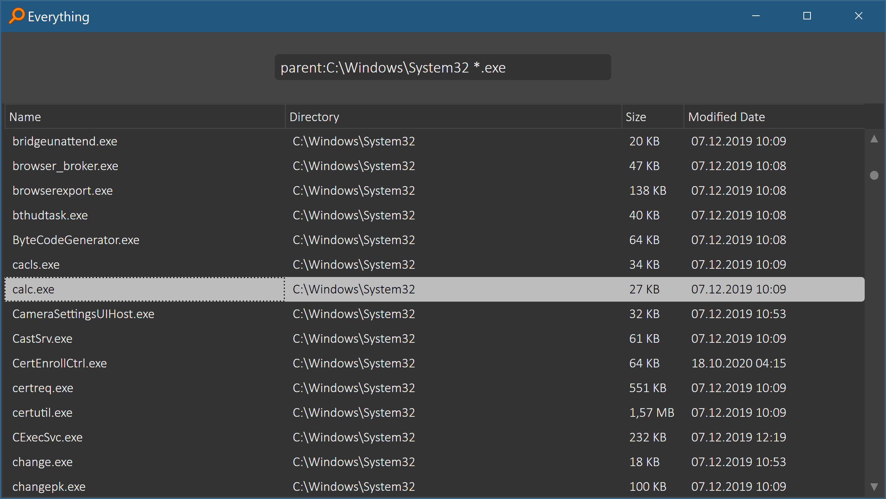

# Dark Everything Frontend

Voidtools Everything frontend with dark mode.


### Screenshot




### Requirements

- [Voidtools Everything installation](https://www.voidtools.com/downloads)
- [.NET 5 Desktop Runtime installation](https://dotnet.microsoft.com/download/dotnet/thank-you/runtime-desktop-5.0.2-windows-x64-installer)


### Download

https://github.com/stax76/Everything.NET/releases


### Usage

ESC key clears the search box, if empty the app exits.

Double-click shows the file in File Explorer.

Right-click and menu key opens the files native shell context menu.

Right-click in the search box shows a context menu with the most recent searches.

F1 key shows the usage section of the readme page.

Up/Down key navigates the main list.


### Syntax

```
Operators:
    space   AND
    |       OR
    !       NOT
    < >     Grouping
    " "     Search for an exact phrase.

Wildcards:
    *       Matches zero or more characters.
    ?       Matches one character.

Macros:
    quot:   Literal double quote (")
    apos:   Literal apostrophe (')
    amp:    Literal ampersand (&)
    lt:     Literal less than (<)
    gt:     Literal greater than (>)
    #<n>:   Literal unicode character <n> in decimal.
    #x<n>:  Literal unicode character <n> in hexadecimal.
    audio:  Search for audio files.
    zip:    Search for compressed files.
    doc:    Search for document files.
    exe:    Search for executable files.
    pic:    Search for picture files.
    video:  Search for video files.

Modifiers:
    ascii:           Enable fast ASCII case comparisons.
    case:            Match case.
    diacritics:      Match diacritical marks.
    file:            Match files only.
    folder:          Match folders only.
    noascii:         Disable fast ASCII case comparisons.
    nocase:          Do not match case.
    nodiacritics:    Do not match diacritical marks.
    nofileonly:      Do not allow files only.
    nofolderonly:    Do not allow folders only.
    nopath:          Do not match path.
    noregex:         Disable regex.
    nowfn:           Do not match the whole filename.
    nowholefilename: Do not match the whole filename.
    nowholeword:     Do not match whole words only.
    nowildcards:     Disable wildcards.
    noww:            Do not match whole words only.
    path:            Match path and file name.
    regex:           Enable regex.
    utf8:            Disable fast ASCII case comparisons.
    wfn:             Match the whole filename.
    wholefilename:   Match the whole filename.
    wholeword:       Match whole words only.
    wildcards:       Enable wildcards.
    ww:              Match whole words only.

Functions:
    album:<text>            Search media for album meta data.
    ansicontent:<text>      Search ANSI file content for text.
    artist:<text>           Search media for artist meta data.
    attrib:<attributes>     Search for files and folders with the specified file attributes.
    attribdupe:             Find files and folders with the same attributes.
    attributes:<attributes> Search for files and folders with the specified file attributes.
    bitdepth:<bitdepth>     Find images with the specified bits per pixel.
    child:<filename>        Search for folders that contain a child with a matching filename.
    childcount:<count>      Search for folders that contain the specified number of subfolders and files.
    childfilecount:<count>  Search for folders that contain the specified number of files.
    childfoldercount:<n>    Search for folders that contain the specified number of subfolders.
    comment:<text>          Search media for comment meta data.
    content:<text>          Search file content for text.
    count:<max>             Limit the number of results to max.
    dateaccessed:<date>     Search for files and folders with the specified date accessed.
    datecreated:<date>      Search for files and folders with the specified date created.
    datemodified:<date>     Search for files and folders with the specified date modified.
    daterun:<date>          Search for files and folders with the specified date run.
    da:<date>               Search for files and folders with the specified date accessed.
    dadupe:                 Find files and folders with the same date accessed.
    dc:<date>               Search for files and folders with the specified date created.
    dcdupe:                 Find files and folders with the same date created.
    dimensions:<w>X<h>      Find images with the specified width and height.
    dm:<date>               Search for files and folders with the specified date modified.
    dmdupe:                 Find files and folders with the same date modified.
    dr:<date>               Search for files and folders with the specified date run.
    dupe:                   Search for duplicated filenames.
    empty:                  Search for empty folders.
    endwith:<text>          Filenames (including extension) ending with text.
    ext:<ext1;ext2;...>     Search for files with a matching extension in the specified semi-colon delimited extension list.
    filelist:<fn1|fn2|...>  Search for a list of file names in the specified pipe (|) delimited file list.
    filelistfilename:<name> Search for files and folders belonging to the file list filename.
    frn:<frn>               Search for files and folders with the specified File Reference Number.
    fsi:<index>             Search for files and folders in the specified zero based internal file system index.
    genre:<text>            Search media for genre meta data.
    height:<height>         Find images with the specified height in pixels.
    infolder:<path>         Search for files and folders in the specified path, excluding subfolders.
    len:<length>            Search for files and folders that match the specified filename length.
    namepartdupe:           Search for files and folders with the same name part.
    orientation:<type>      Search for images with the specified orientation (landscape or portrait).
    parent:<path>           Search for files and folders in the specified path, excluding subfolders.
    parents:<count>         Search for files and folders with the specified number of parent folders.
    rc:<date>               Search for files and folders with the specified recently changed date.
    recentchange:<date>     Search for files and folders with the specified recently changed date.
    root:                   Search for files and folders with no parent folders.
    runcount:<count>        Search for files and folders with the specified run count.
    shell:<name>            Search for a known shell folder name, including subfolders and files.
    size:<size>             Search for files with the specified size in bytes.
    sizedupe:               Search for duplicated sizes.
    startwith:<text>        Search for filenames starting with text.
    title:<text>            Search media for title meta data.
    track:<number>          Find media files with the specified track number.
    type:<type>             Search for files and folders with the specified type.
    utf16content:<text>     Search UTF-16 file content for text.
    utf16becontent:<text>   Search UTF-16 Big Endian file content for text.
    utf8content:<text>      Search UTF-8 file content for text.
    width:<width>           Find images with the specified width in pixels.

Function Syntax:
    function:value       Equal to value.
    function:<=value     Less than or equal to value.
    function:<value      Less than value.
    function:=value      Equal to value.
    function:>value      Greater than value.
    function:>=value     Greater than or equal to value.
    function:start..end  Is in the range of values from start to end.
    function:start-end   Is in the range of values from start to end.

Size Syntax:
    size[kb|mb|gb]

Size Constants:
    empty
    tiny      0 KB < size <= 10 KB
    small     10 KB < size <= 100 KB
    medium    100 KB < size <= 1 MB
    large     1 MB < size <= 16 MB
    huge      16 MB < size <= 128 MB
    gigantic  size > 128 MB
    unknown

Date Syntax:
    year
    month/year or year/month depending on locale settings
    day/month/year, month/day/year or year/month/day depending on locale settings
    YYYY[-MM[-DD[Thh[:mm[:ss[.sss]]]]]]
    YYYYMM[DD[Thh[mm[ss[.sss]]]]]

Date Constants:
    today
    yesterday
    tomorrow
    <last|past|prev|current|this|coming|next><year|month|week>
    <last|past|prev|coming|next><x><years|months|weeks|days|hours|minutes|mins|seconds|secs>
    january|february|march|april|may|june|july|august|september|october|november|december
    jan|feb|mar|apr|may|jun|jul|aug|sep|oct|nov|dec
    sunday|monday|tuesday|wednesday|thursday|friday|saturday
    sun|mon|tue|wed|thu|fri|sat
    unknown

Attribute Constants:
    A    Archive
    C    Compressed
    D    Directory
    E    Encrypted
    H    Hidden
    I    Not content indexed
    L    Reparse point
    N    Normal
    O    Offline
    P    Sparse file
    R    Read only
    S    System
    T    Temporary
    V    Device

Regex Syntax:

a|b       Matches a or b
gr(a|e)y  Matches gray or grey
.         Matches any single character
[abc]     Matches a single character a, b or c
[^abc]    Matches any single character except a, b or c
[a-z]     Matches a single charactor in the range a to z
[a-zA-Z]  Matches a single charactor in the range a to z or A to Z
^         Matches the start of the filename
$         Matches the end of the filename
( )       Defines a marked subexpression
\n        Matches what the nth marked subexpression matched, where n is a digit from 1 to 9
\b        Match word boundaries
*         Matches the preceding element zero or more times
?         Matches the preceding element zero or one times
+         Matches the preceding element one or more times
*?        Lazily matches the preceding element zero or more times
+?        Lazily matches the preceding element one or more times
{x}       Matches the preceding element x times
{x,}      Matches the preceding element x or more times
{x,y}     Matches the preceding element between x and y times
\         Escape special character
```


Related apps
------------

Find a list of related apps:

https://stax76.github.io/frankskare
